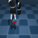

# Choreographer: Learning and Adapting Skills in Imagination
[[website](https://skillchoreographer.github.io/)] [[paper](https://arxiv.org/abs/2211.13350)]

[](https://paperswithcode.com/sota/unsupervised-reinforcement-learning-on-urlb-3?p=choreographer-learning-and-adapting-skills-in)

This is the code for Choreographer: a model-based agent that discovers and learns unsupervised skills in latent imagination, and it's able to efficiently coordinate and adapt the skills to solve downstream tasks.


<p align="center">
    
    
    
    
</p>

If you find the code useful, please refer to our work using:

```
@inproceedings{
        Mazzaglia2023Choreographer,
        title={Choreographer: Learning and Adapting Skills in Imagination},
        author={Pietro Mazzaglia and Tim Verbelen and Bart Dhoedt and Alexandre Lacoste and Sai Rajeswar},
        booktitle={International Conference on Learning Representations},
        year={2023},
        url={https://openreview.net/forum?id=PhkWyijGi5b}
}
```

## Requirements
We assume you have access to a GPU that can run CUDA 10.2 and CUDNN 8. Then, the simplest way to install all required dependencies is to create an anaconda environment by running
```sh
conda env create -f conda_env.yml
```
After the instalation ends you can activate your environment with
```sh
conda activate choreo
```

## Implemented Agents
| Agent | Command
|---|---|
| Choreographer | `agent=choreo` 

## Available Domains
We support the following domains.
| Domain | Tasks |
|---|---|
| `walker` | `stand`, `walk`, `run`, `flip` |
| `quadruped` | `walk`, `run`, `stand`, `jump` |
| `jaco` | `reach_top_left`, `reach_top_right`, `reach_bottom_left`, `reach_bottom_right` |
| `mw` | `reach` |

## Instructions
### Offline Datasets
The datasets from the ExORL paper can be downloaded on their [repository](https://github.com/denisyarats/exorl).
The default loading directory is:
```sh
~/urlb_datasets/${dataset}/${domain}/${collection_method}/buffer
```
For example:
```sh
~/urlb_datasets/exorl/walker/rnd/buffer
```
The dataset folder can be changed in the `offline_train.yaml` file, replacing the value at the key `dataset_dir` or it can be provided when launching the offline pre-training, as a command line argument.
For example:
```sh
python offline_train.py ... dataset_dir=$MYPATH/exorl/walker/rnd/buffer
```
### Offline Pre-training
To run pre-training from offline data use the `offline_train.py` script
```sh
python offline_train.py configs=dmc_states agent=choreo dataset=exorl collection_method=rnd domain=walker seed=1
```
This script will produce several agent snapshots after training for `10k`, `50k`, `100k`, and `200k` update steps. The snapshots will be stored under the following directory:
```sh
./offline_models/${dataset}/${collection_method}/${domain}/${agent.name}/${seed}
```
For example:
```sh
./offline_models/exorl/rnd/walker/choreo/1
```

### Parallel to exploration Pre-training

To run pre-training in parallel to (LBS) exploration use the `pretrain.py` script
```sh
python pretrain.py configs=dmc_pixels agent=choreo domain=walker
```
This script will produce several agent snapshots after training for `100k`, `500k`, `1M`, and `2M` frames. The snapshots will be stored under the following directory:
```sh
./pretrained_models/${obs_type}/${domain}/${agent.name}/${seed}
```
For example:
```sh
./pretrained_models/pixels/walker/choreo/1
```

### Fine-tuning
Once you have pre-trained your agent, you can fine-tune it on a downstream task. 

#### From offline dataset
For example, let's say you have pre-trained Choreographer on the `walker` domain ExORL data, you can fine-tune it on `walker_run` by running the following command:
```sh
python finetune.py configs=dmc_states agent=choreo task=walker_run from_offline=True dataset=exorl collection_method=rnd snapshot_ts=200000 seed=1
```
This will load a snapshot stored in `./offline_models/exorl/rnd/walker/choreo/1/snapshot_200000.pt`, initialize `Choreographer`'s models and skill policies with it, and start training on `walker_run` using the meta-controller to maximize the extrinsic rewards of the task.

#### From parallel exploration
For example, let's say you have pre-trained Choreographer on the `walker` domain, you can fine-tune it on `walker_run` by running the following command:
```sh
python finetune.py configs=dmc_pixels agent=choreo task=walker_run snapshot_ts=2000000 seed=1
```
This will load a snapshot stored in `./pretrained_models/pixels/walker/choreo/1/snapshot_2000000.pt`, initialize `Choreographer`'s models and skill policies with it, and start training on `walker_run` using the meta-controller to maximize the extrinsic rewards of the task.

### Zero-shot

#### Jaco

To perform zero-shot evaluation on Jaco, ensure that you pre-trained the model in the pixel settings and that is correctly stored under `pretrained_models`. Then, you can run:


```sh
python finetune.py configs=dmc_pixels task=$JACO_TASK snapshot_ts=2000000 num_train_frames=10 num_eval_episodes=100 eval_goals=True
```

where $JACO_TASK is one of the Jaco reach task.

#### Meta-World

To pre-train on the Meta-World reach environent you can run the following command:

```sh
python pretrain.py configs=mw_pixels domain=mw`
```

To perform zero-shot evaluation on Meta-World, ensure that you pre-trained the model and that is correctly stored under `pretrained_models`. Then, you can run:

```sh
python finetune.py configs=mw_pixels task=mw_reach snapshot_ts=2000000 task_id=$TASK_ID num_train_frames=10 num_eval_episodes=100 eval_goals=True agent.update_skill_every_step=50
```

where $TASK_ID is a value in `range(0,50)`. The goals are stored under `mw_tasks/reach_harder`. There are 10 sets of goals, which can be used by setting the evaluation seed, e.g. `seed=0`.

### Monitoring

#### Tensorboard
Logs are stored in the `exp_local` folder. To launch tensorboard run:
```sh
tensorboard --logdir exp_local
```
The console output is also available in a form:
```
| train | F: 6000 | S: 3000 | E: 6 | L: 1000 | R: 5.5177 | FPS: 96.7586 | T: 0:00:42
```
a training entry decodes as
```
F  : total number of environment frames
S  : total number of agent steps
E  : total number of episodes
R  : episode return
FPS: training throughput (frames per second)
T  : total training time
```

#### Weights and Bias (wandb)
You can also use Weights and Bias, by launching the experiments with `use_wandb=True`.

### Acknowledgments

The environment implementations come from [URLB](https://github.com/rll-research/url_benchmark).
The model implementation is inspired by [DreamerV2](https://github.com/danijar/dreamerv2).
We also thank the authors of [MetaWorld](https://meta-world.github.io/).
